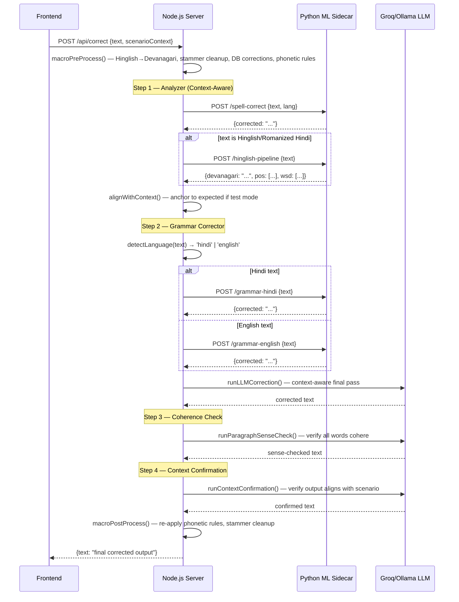
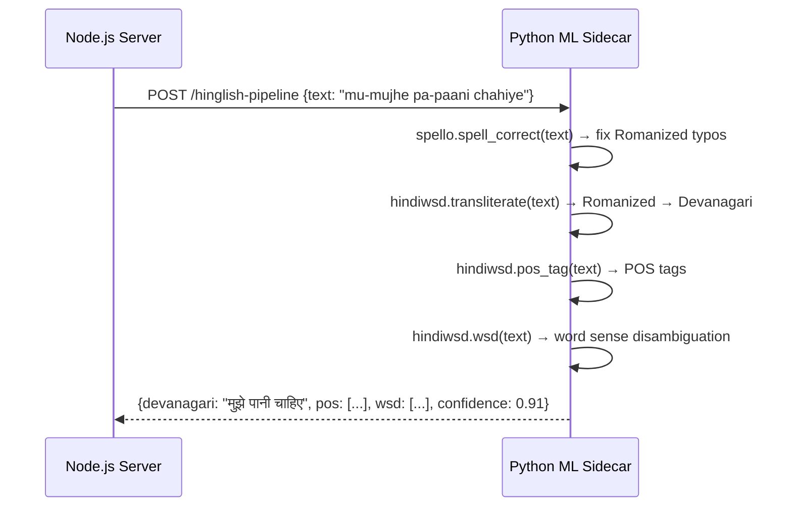

# Design Document: Autocorrect Pipeline Upgrade

## Overview

WisperFlow helps people with speech impairments (stammering, dysarthria) communicate by converting their garbled speech into clean Hindi/Hinglish text. This upgrade adds dedicated ML-powered spell and grammar correction layers (Spello, GEC-mT5, GrammarCorrectionTransformer, hindiwsd), restructures the macro correction pipeline into an explicit 4-step flow, expands the stammerer test dataset, and migrates deployment from Vercel to a platform capable of running Python ML models alongside the existing Node.js/Express server.

The current pipeline runs entirely in Node.js (dictionary lookups + phonetic rules + Groq LLM). The new design introduces a **Python FastAPI sidecar** that hosts the heavy NLP models, called over HTTP from the Node.js server. The sidecar is co-deployed on the same host (Railway.app or Render.com) so latency stays low. No existing endpoints or behaviour unrelated to the correction pipeline are changed.

---

## Architecture

```mermaid
graph TD
    subgraph Browser
        UI[React/TypeScript Frontend]
    end

    subgraph "Node.js Express Server (server/index.js)"
        API["/api/correct\n/api/test/accuracy\n/api/transcribe\n..."]
        Pipeline[runCorrectionPipeline()]
        MacroPre[macroPreProcess()]
        Step1[Step 1: Analyzer\nContext-Aware]
        Step2[Step 2: Grammar Corrector\nLLM + GEC models]
        Step3[Step 3: Coherence Check\nrunParagraphSenseCheck()]
        Step4[Step 4: Context Confirmation\nrunContextConfirmation()]
        MacroPost[macroPostProcess()]
        NLPClient[nlpClient.js\nHTTP calls to sidecar]
    end

    subgraph "Python FastAPI Sidecar (ml_sidecar/)"
        SpelloEP[POST /spell-correct\nSpello]
        GECHindi[POST /grammar-hindi\nGEC-mT5-Small-Hindi]
        GECEnglish[POST /grammar-english\nGrammarCorrectionTransformer]
        HindiwsdEP[POST /hinglish-pipeline\nhindiwsd: spell+translit+POS+WSD]
    end

    subgraph "Deployment (Railway.app / Render.com)"
        NodeSvc[Node.js Service\nPort 3001]
        PythonSvc[Python Service\nPort 8000]
    end

    UI -->|POST /api/correct| API
    API --> Pipeline
    Pipeline --> MacroPre
    MacroPre --> Step1
    Step1 --> NLPClient
    NLPClient -->|/spell-correct| SpelloEP
    NLPClient -->|/hinglish-pipeline| HindiwsdEP
    Step1 --> Step2
    Step2 --> NLPClient
    NLPClient -->|/grammar-hindi or /grammar-english| GECHindi
    NLPClient -->|/grammar-hindi or /grammar-english| GECEnglish
    Step2 --> Step3
    Step3 -->|LLM call| API
    Step3 --> Step4
    Step4 -->|LLM call| API
    Step4 --> MacroPost
```

---

## Sequence Diagrams

### Main Correction Flow (POST /api/correct)



### Hinglish Dedicated Pipeline (hindiwsd)



---

## Components and Interfaces

### Component 1: Python FastAPI Sidecar (`ml_sidecar/`)

**Purpose**: Hosts all Python ML models (Spello, GEC-mT5, hindiwsd, GrammarCorrectionTransformer). Exposes a simple HTTP API callable from Node.js.

**Interface**:
```typescript
// POST /spell-correct
interface SpellCorrectRequest  { text: string; lang?: 'hindi' | 'hinglish' | 'english' }
interface SpellCorrectResponse { corrected: string; changed: boolean }

// POST /grammar-hindi
interface GrammarHindiRequest  { text: string }
interface GrammarHindiResponse { corrected: string }

// POST /grammar-english
interface GrammarEnglishRequest  { text: string }
interface GrammarEnglishResponse { corrected: string }

// POST /hinglish-pipeline
interface HinglishPipelineRequest  { text: string }
interface HinglishPipelineResponse {
  spellCorrected: string      // after Spello
  devanagari: string          // after hindiwsd transliteration
  pos: Array<[string, string]> // [(word, tag), ...]
  wsd: Array<[string, string]> // [(word, sense), ...]
  confidence: number
}

// GET /health
interface SidecarHealthResponse { ok: boolean; models: string[] }
```

**Responsibilities**:
- Load and cache all ML models at startup (not per-request)
- Detect language if `lang` not specified (Devanagari check via Unicode range)
- Return graceful fallback (input unchanged) on model errors
- Log model load times and inference times

### Component 2: NLP Client (`server/nlpClient.js`) — new file

**Purpose**: Thin Node.js HTTP client that calls the Python sidecar. Handles timeouts, retries, and graceful degradation if the sidecar is unavailable.

**Interface**:
```typescript
interface NLPClientConfig { baseUrl: string; timeoutMs: number }

async function spellCorrect(text: string, lang?: string): Promise<string>
async function grammarCorrectHindi(text: string): Promise<string>
async function grammarCorrectEnglish(text: string): Promise<string>
async function hinglishPipeline(text: string): Promise<HinglishPipelineResponse>
function isSidecarAvailable(): boolean
```

**Responsibilities**:
- Wrap all sidecar calls with a configurable timeout (default 5 s)
- If sidecar is down or times out → return input text unchanged (graceful degradation)
- Expose `isSidecarAvailable()` for health check endpoint

### Component 3: Updated `runCorrectionPipeline()` (`server/index.js`)

**Purpose**: Orchestrates the upgraded 4-step macro pipeline. Replaces the current `macroPreProcess → alignWithContext → runLLMCorrection → macroPostProcess → alignWithContext` flow.

**Interface** (unchanged signature, new internal logic):
```typescript
async function runCorrectionPipeline(
  rawText: string,
  corrections: Correction[],
  pronunciation: PronunciationEntry[],
  expectedContext?: string | null,
  scenarioContext?: string | null
): Promise<string>
```

**Step sequence**:
1. `macroPreProcess()` — existing, unchanged
2. **Step 1 — Analyzer**: `spellCorrect()` via NLP client → `hinglishPipeline()` if Romanized → `alignWithContext()` if test mode
3. **Step 2 — Grammar Corrector**: language detection → `grammarCorrectHindi()` or `grammarCorrectEnglish()` → `runLLMCorrection()`
4. **Step 3 — Coherence Check**: `runParagraphSenseCheck()`
5. **Step 4 — Context Confirmation**: `runContextConfirmation()` (only when `scenarioContext` present)
6. `macroPostProcess()` — existing, unchanged

### Component 4: Language Detector (inline utility, `server/index.js`)

**Purpose**: Determines whether text is primarily Hindi (Devanagari) or English to route grammar correction.

```typescript
function detectLanguage(text: string): 'hindi' | 'english'
// Rule: count Devanagari codepoints (U+0900–U+097F).
// If > 40% of alphabetic chars are Devanagari → 'hindi', else 'english'
```

### Component 5: Expanded `STAMMERER_DATASET` (`server/testDataset.js`)

**Purpose**: Adds realistic stammerer voice/text samples to improve accuracy testing coverage. New entries cover: sentence-level Hindi repetition with complex phonetics, Hinglish with multiple stammer types, and edge cases with Whisper distortions on longer phrases.

---

## Data Models

### Sidecar Request/Response (Python Pydantic models)

```python
class SpellCorrectIn(BaseModel):
    text: str
    lang: Optional[Literal['hindi', 'hinglish', 'english']] = None

class SpellCorrectOut(BaseModel):
    corrected: str
    changed: bool

class GrammarIn(BaseModel):
    text: str

class GrammarOut(BaseModel):
    corrected: str

class HinglishPipelineIn(BaseModel):
    text: str

class HinglishPipelineOut(BaseModel):
    spell_corrected: str
    devanagari: str
    pos: List[Tuple[str, str]]
    wsd: List[Tuple[str, str]]
    confidence: float
```

### Deployment Configuration

```yaml
# Railway / Render: two services in same project

service_node:
  name: wisper-flow
  runtime: nodejs20
  build_command: "npm install && npm run build"
  start_command: "node server/index.js"
  env:
    PORT: 3001
    GROQ_API_KEY: ${{ secret }}
    ML_SIDECAR_URL: "http://localhost:8000"   # same host, internal

service_python:
  name: wisper-flow-ml
  runtime: python3.11
  build_command: "pip install -r ml_sidecar/requirements.txt"
  start_command: "uvicorn ml_sidecar.main:app --host 0.0.0.0 --port 8000"
```

### New Stammerer Dataset Entry Shape (unchanged structure)

```typescript
interface StammererEntry {
  id: number          // 5300+ range for new entries
  input: string       // raw Whisper/typed input with stammer patterns
  expected: string    // clean Devanagari target
  lang: 'hindi' | 'hinglish'
  category: string    // 'needs' | 'health' | 'school' | 'feelings' | 'complex' | ...
}
```

---

## Algorithmic Pseudocode

### Upgraded `runCorrectionPipeline()` — 4-Step Flow

```pascal
ALGORITHM runCorrectionPipeline(rawText, corrections, pronunciation, expectedContext, scenarioContext)
INPUT:  rawText          — raw Whisper/typed text
        corrections      — user-saved word corrections
        pronunciation    — user pronunciation profile
        expectedContext  — target text for test mode (nullable)
        scenarioContext  — stranger's question/scenario (nullable)
OUTPUT: finalText        — cleaned, corrected Devanagari text

BEGIN
  userCorrections ← normalizeCorrections(corrections)
  pronProfile     ← normalizePronunciationProfile(pronunciation)

  // ── Macro Pre-Processing (unchanged) ──────────────────────────────────
  preProcessed ← macroPreProcess(rawText, userCorrections, pronProfile)
  // Includes: Hinglish→Devanagari dict, stammer regex, DB corrections,
  //           pronunciation profile, phonetic rules

  // ── STEP 1: Analyzer (Context-Aware) ──────────────────────────────────
  // Runs spell correction FIRST, before grammar.
  // Handles test-mode context AND main page scenario context.

  spellCorrected ← spellCorrect(preProcessed)          // Spello via sidecar
  
  IF isRomanizedHindi(spellCorrected) THEN
    hinglishResult ← hinglishPipeline(spellCorrected)  // hindiwsd via sidecar
    // hindiwsd: spell → transliterate → POS tag → WSD
    analyzed ← hinglishResult.devanagari
  ELSE
    analyzed ← spellCorrected
  END IF

  IF expectedContext IS NOT NULL THEN
    analyzed ← alignWithContext(analyzed, expectedContext, userCorrections, pronProfile)
    // Context from both: test mode history AND main text box
  END IF

  // ── STEP 2: Grammar Corrector ─────────────────────────────────────────
  lang ← detectLanguage(analyzed)   // 'hindi' | 'english'

  IF lang = 'hindi' THEN
    grammarFixed ← grammarCorrectHindi(analyzed)    // GEC-mT5-Small-Hindi
  ELSE
    grammarFixed ← grammarCorrectEnglish(analyzed)  // GrammarCorrectionTransformer
  END IF

  // LLM pass: context-aware, DB-informed, Whisper-error-aware
  llmCorrected ← runLLMCorrection(rawText, grammarFixed, userCorrections, pronProfile,
                                   expectedContext, scenarioContext)

  // ── STEP 3: Coherence Check ───────────────────────────────────────────
  // Verify all words together make sense in context.
  // If not coherent, re-thinks output using prev+next word relationships.
  senseChecked ← runParagraphSenseCheck(rawText, llmCorrected, userCorrections,
                                         pronProfile, expectedContext, scenarioContext)

  // ── STEP 4: Final Context Confirmation ────────────────────────────────
  // Only when a scenario/stranger context exists.
  // Re-checks that output aligns with what was asked.
  IF scenarioContext IS NOT NULL THEN
    confirmed ← runContextConfirmation(rawText, senseChecked, scenarioContext, expectedContext)
  ELSE
    confirmed ← senseChecked
  END IF

  // ── Macro Post-Processing (unchanged) ─────────────────────────────────
  finalText ← macroPostProcess(confirmed, userCorrections, pronProfile)

  RETURN finalText
END
```

**Preconditions:**
- `rawText` is non-empty string
- `corrections` and `pronunciation` are arrays (may be empty)
- Python sidecar is either available or NLP client degrades gracefully

**Postconditions:**
- Returns non-empty string (at minimum returns `rawText` unchanged)
- Output is Devanagari if input contained Hindi/Hinglish
- Output word count ≤ `max(ceil(inputWords × 1.2), inputWords + 4)`

**Loop Invariants:** N/A (sequential pipeline, no loops)

---

### Spell Correction Step — NLP Client with Graceful Degradation

```pascal
ALGORITHM spellCorrect(text, lang)
INPUT:  text — pre-processed text
        lang — optional language hint
OUTPUT: corrected text (same as input on failure)

BEGIN
  IF NOT isSidecarAvailable() THEN
    RETURN text    // graceful degradation — sidecar down
  END IF

  TRY WITH TIMEOUT 5000ms
    response ← httpPost(SIDECAR_URL + "/spell-correct", {text, lang})
    IF response.changed THEN
      RETURN response.corrected
    ELSE
      RETURN text
    END IF
  CATCH (TimeoutError OR NetworkError)
    LOG "[nlp-client] spell-correct timeout/error, using input as-is"
    RETURN text
  END TRY
END
```

---

### Language Detection

```pascal
ALGORITHM detectLanguage(text)
INPUT:  text — any string
OUTPUT: 'hindi' | 'english'

BEGIN
  alphaChars    ← count chars WHERE char matches [a-zA-Z\u0900-\u097F]
  devanagari    ← count chars WHERE char in Unicode range U+0900–U+097F

  IF alphaChars = 0 THEN
    RETURN 'hindi'   // default for empty/punctuation-only
  END IF

  ratio ← devanagari / alphaChars

  IF ratio > 0.40 THEN
    RETURN 'hindi'
  ELSE
    RETURN 'english'
  END IF
END
```

---

### Python Sidecar — Hinglish Pipeline (`/hinglish-pipeline`)

```pascal
ALGORITHM hinglishPipeline(text)
INPUT:  text — Romanized Hindi text (may have stammer patterns)
OUTPUT: HinglishPipelineOut

BEGIN
  // Stage 1: Spell correction for Romanized Hindi
  spellCorrected ← spello.spell_correct(text)

  // Stage 2: Transliteration → Devanagari
  devanagari ← hindiwsd.transliterate(spellCorrected)

  // Stage 3: POS Tagging
  posTags ← hindiwsd.pos_tag(devanagari)

  // Stage 4: Word Sense Disambiguation
  wsdTags ← hindiwsd.wsd(devanagari, context=posTags)

  confidence ← computeConfidence(posTags, wsdTags)

  RETURN HinglishPipelineOut(
    spell_corrected = spellCorrected,
    devanagari      = devanagari,
    pos             = posTags,
    wsd             = wsdTags,
    confidence      = confidence
  )
END
```

---

## Key Functions with Formal Specifications

### `detectLanguage(text: string): 'hindi' | 'english'`

**Preconditions:**
- `text` is a non-null string (may be empty)

**Postconditions:**
- Returns exactly `'hindi'` or `'english'`
- Returns `'hindi'` when > 40% of alphabetic characters are Devanagari
- No side effects

---

### `spellCorrect(text, lang?) → string` (nlpClient.js)

**Preconditions:**
- `text` is a non-empty string

**Postconditions:**
- Returns a string of length ≥ 1
- If sidecar unavailable or timeout → returns `text` unchanged
- Never throws; all errors caught internally

---

### `runCorrectionPipeline()` — Step ordering invariant

**Preconditions:**
- Step 1 (spell correction) always runs before Step 2 (grammar correction)
- Step 2 always runs before Step 3 (coherence check)
- Step 3 always runs before Step 4 (context confirmation)

**Postconditions:**
- If all steps succeed → output reflects grammar + coherence + context alignment
- If sidecar fails at Step 1 or 2 → pipeline continues with pre-processed text (no crash)
- If LLM fails at Step 2 → pipeline continues with grammar-model output (no crash)

---

## Error Handling

### Scenario 1: Python Sidecar Unavailable at Request Time

**Condition**: `ml_sidecar` service is not reachable (cold start, crash, timeout)  
**Response**: `nlpClient.js` catches the error and returns `text` unchanged; a warning is logged  
**Recovery**: Pipeline continues with the pre-processed text — Spello and GEC improvements are skipped but the LLM correction still runs; user sees a result, not an error

### Scenario 2: ML Model Cold Start Latency

**Condition**: GEC-mT5 or hindiwsd takes > 5 s on first request  
**Response**: NLP client timeout fires; sidecar call falls back gracefully  
**Recovery**: Sidecar warms up models on the next request; subsequent requests are fast (models cached in memory)

### Scenario 3: Language Misdetection

**Condition**: `detectLanguage()` returns `'english'` for a mostly-Hindi sentence  
**Response**: `GrammarCorrectionTransformer` (English model) is called; it will mostly pass Hindi text through unchanged  
**Recovery**: LLM step still runs and can recover the Hindi grammar from context

### Scenario 4: hindiwsd Transliteration Error

**Condition**: `hindiwsd.transliterate()` raises an exception on unexpected input  
**Response**: The sidecar endpoint catches the exception and returns `{"devanagari": original_text, "confidence": 0.0}`  
**Recovery**: Node.js receives the original text and passes it to the LLM correction step

### Scenario 5: Deployment Platform Cold Start (Render free tier)

**Condition**: Service sleeps after 15 min of inactivity  
**Response**: First request takes ~30 s to wake; subsequent requests normal  
**Recovery**: Consider Railway.app (always-on on Starter plan) or add a keep-alive ping from frontend; document in README

---

## Testing Strategy

### Unit Testing Approach

- Test `detectLanguage()` with Devanagari, Latin, mixed, and empty inputs
- Test `nlpClient.spellCorrect()` with sidecar mocked as down (should return input)
- Test the 4-step ordering in `runCorrectionPipeline()` by mocking each step and verifying call order
- Test new `STAMMERER_DATASET` entries parse correctly and have valid `id`, `input`, `expected`, `lang` fields

### Property-Based Testing Approach

**Property Test Library**: `fast-check` (already in Node.js ecosystem, add as devDependency)

Key properties to test:
- **Word-count bound**: for any input text, the pipeline output must satisfy `outputWords ≤ max(ceil(inputWords × 1.2), inputWords + 4)`
- **No crash on arbitrary input**: `runCorrectionPipeline(text, [], [], null, null)` never throws for any string
- **Graceful degradation**: when sidecar is mocked as unreachable, output is never empty when input is non-empty
- **Language detection consistency**: `detectLanguage(text)` is deterministic — same input always returns same result

### Integration Testing Approach

- Use existing `POST /api/test/accuracy` endpoint to run all `STAMMERER_DATASET` entries through the full pipeline (with sidecar running)
- Compare accuracy scores before and after upgrade (baseline: current pipeline)
- Target: overall accuracy ≥ current baseline on Hindi + Hinglish datasets
- Sidecar health check: `GET /health` on Python service returns `{ok: true}` before running accuracy tests

### Accuracy Validation (Step 6 from Requirements)

The existing `/api/test/accuracy` endpoint already runs `STAMMERER_DATASET` + `SENTENCE_DATASET`. After the upgrade:
1. Start the Python sidecar locally
2. `POST /api/test/accuracy` from the Node server
3. Compare `byDataset.stammerer_hindi.accuracy` and `byDataset.stammerer_hinglish.accuracy` before/after

---

## Performance Considerations

- **Model loading**: All ML models must be loaded at sidecar startup, not per-request. FastAPI lifespan events (`@asynccontextmanager`) handle this.
- **Sidecar timeout**: NLP client uses 5 s timeout per call. For mT5 on CPU this is tight — Railway/Render starter plans have sufficient CPU for small models. Monitor p95 latency.
- **LLM calls**: Steps 2, 3, and 4 each call the LLM. On Groq this is fast (< 1 s each). On free Render with Ollama it will be slower — the sidecar models are more critical then.
- **Concurrent users**: Railway.app starter supports ~100 concurrent connections. The Python sidecar uses Uvicorn + async FastAPI so it handles concurrent requests without blocking. GEC-mT5 inference is synchronous CPU-bound — consider a `ProcessPoolExecutor` for concurrent grammar requests if needed.
- **Caching**: The existing in-memory cache in `server/index.js` (keyed by text) remains in place and will cache the full pipeline result including sidecar outputs.

---

## Security Considerations

- The Python sidecar should **only be reachable internally** (same host/network). It must not be exposed to the public internet. On Railway.app, use a private service and connect via internal DNS.
- The sidecar has no authentication — it trusts the Node.js server. This is acceptable only because it is not publicly exposed.
- Input to ML models should be length-limited (e.g., 2000 chars) to prevent DoS via very long strings.
- The existing `rateLimit` middleware on Node.js routes is kept as-is and applies to all `/api/*` endpoints.
- Environment variables (`GROQ_API_KEY`, `ML_SIDECAR_URL`) remain in `.env` and are injected as secrets on the deployment platform — they are never hardcoded.

---

## Dependencies

### New Node.js Dependencies
- None strictly required; `node-fetch` is built-in since Node 18+ (`globalThis.fetch`)

### New Python Dependencies (`ml_sidecar/requirements.txt`)
```
fastapi==0.111.0
uvicorn[standard]==0.29.0
spello==0.1.0              # PyPI: spell correction for Hindi/Hinglish
transformers==4.41.0        # for GEC-mT5-Small-Hindi + GrammarCorrectionTransformer
torch==2.3.0                # CPU-only variant preferred for memory constraints
sentencepiece==0.2.0        # required by mT5 tokenizer
hindiwsd==0.1.0             # PyPI: hindiwsd package for Hinglish pipeline
pydantic==2.7.0
```

### New Infrastructure
- **Railway.app** (recommended) or **Render.com**: replaces Vercel
  - Railway Starter plan: always-on, $5/month free credit, supports Node.js + Python services, ~512 MB RAM per service
  - Render free tier: sleeps after inactivity, but free; upgrade to $7/mo for always-on
  - Public URL format: `https://wisper-flow.railway.app` or `https://wisper-flow.onrender.com`

### Changed Infrastructure
- `api/index.js` (Vercel serverless wrapper): kept in repo for reference but not used in new deployment
- `vercel.json`: kept but not used; document in README that deployment is now via Railway/Render

### Existing Dependencies (unchanged)
- Node.js/Express, React/TypeScript, Vite, Groq API (llama-3.3-70b-versatile), Ollama (optional local)


---

## Correctness Properties

These are invariants and properties that must hold across all pipeline executions. They inform property-based tests.

### Property 1: Pipeline Never Returns Empty Output
For any non-empty `rawText`, `runCorrectionPipeline(rawText, ...)` must return a non-empty string.
```
∀ rawText ≠ "" → output ≠ ""
```

**Validates: Requirements 4.4**

### Property 2: Word Count Bound
Output word count must not exceed `max(ceil(inputWords × 1.2), inputWords + 4)`:
```
∀ input: outputWords ≤ max(⌈inputWords × 1.2⌉, inputWords + 4)
```

**Validates: Requirements 4.5**

### Property 3: Step Ordering Invariant
Steps execute strictly in order 1 → 2 → 3 → 4. No step receives input from a later step:
```
∀ execution: input(step_n+1) = output(step_n)
```

**Validates: Requirements 4.1**

### Property 4: Graceful Degradation
When the sidecar is unavailable, the pipeline produces output ≥ the pre-processed text quality (never worse than if sidecar calls were simply skipped):
```
∀ sidecarDown: output ≠ null ∧ output.length > 0
```

**Validates: Requirements 1.3, 2.5, 4.4**

### Property 5: Language Detection Determinism
`detectLanguage(text)` is a pure function — same input always yields same output:
```
∀ text: detectLanguage(text) = detectLanguage(text)   (no randomness, no side effects)
```

**Validates: Requirements 2.1, 2.2**

### Property 6: Step 4 Conditional Execution
Context confirmation only runs when `scenarioContext` is provided:
```
scenarioContext = null → runContextConfirmation is NOT called
scenarioContext ≠ null → runContextConfirmation IS called
```

**Validates: Requirements 4.3**

### Property 7: Sidecar Input Length Safety
No string longer than 2000 characters is ever passed to a sidecar ML model:
```
∀ text passed to sidecar endpoint: text.length ≤ 2000
```

**Validates: Requirements 8.8**
