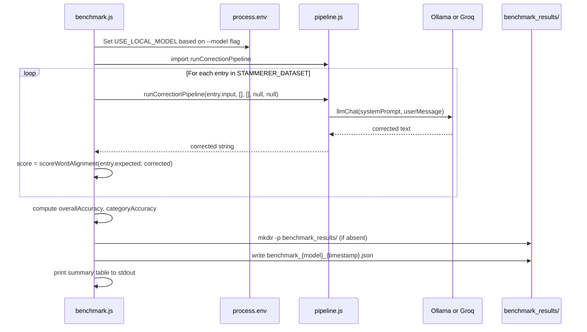

# Design Document: LLM Migration to Phi-4-mini

## Overview

WisperFlow currently routes all three LLM correction passes (grammar correction, coherence check,
context confirmation) through the Groq `llama-3.3-70b-versatile` API. This migration replaces
that LLM with Microsoft Phi-4-mini served locally via Ollama, conditioned on the new model
meeting or exceeding the current Groq baseline accuracy on the expanded `STAMMERER_DATASET`.

The change touches five areas: (1) a one-line default change and fallback logic in
`server/index.js`; (2) extraction of the correction pipeline into a shared `server/pipeline.js`
module; (3) a new dataset generator script; (4) a new benchmark runner; and (5) a new accuracy
comparison script.

## Architecture

```mermaid
graph TD
    A[server/index.js<br/>Express server] -->|imports| P[server/pipeline.js<br/>runCorrectionPipeline]
    B[server/benchmark.js<br/>standalone CLI] -->|imports| P
    P -->|llmChat()| C{USE_LOCAL_MODEL?}
    C -->|true| D[Ollama<br/>phi4-mini]
    C -->|false| E[Groq API<br/>llama-3.3-70b-versatile]
    D -->|connection error + GROQ_API_KEY exists| E
    F[server/generateDataset.js<br/>standalone CLI] -->|appends to| G[server/testDataset.js]
    H[server/compareAccuracy.js<br/>standalone CLI] -->|reads| I[benchmark_results/*.json]
    B -->|writes| I
```

## Key Design Decision: Pipeline Extraction

`server/index.js` calls `app.listen()` at module load time. A standalone benchmark script cannot
`import` it without inadvertently starting an Express server and binding a port.

**Chosen approach — extract to `server/pipeline.js`:**

- Move `runCorrectionPipeline()` and all helper functions it depends on
  (`runLLMCorrection`, `runParagraphSenseCheck`, `runContextConfirmation`,
  `macroPreProcess`, `macroPostProcess`, `llmChat`, `ollamaChat`, `groqFetch`,
  `enforceWordLimit`, `countWords`, `wordOverlap`, `getTopicFromScenario`,
  `detectLanguage`, `isRomanizedHindi`) out of `server/index.js` into a new
  `server/pipeline.js` module.
- `server/index.js` imports `runCorrectionPipeline` from `server/pipeline.js` and remains
  the Express entry point.
- `server/benchmark.js` imports the same `runCorrectionPipeline` without any Express side
  effect.

This is strictly cleaner than the `BENCHMARK_MODE` env-var trick and avoids fragile
import-time side-effect suppression.

## Components and Interfaces

### server/pipeline.js (new)

**Purpose**: Stateless correction pipeline — no HTTP, no Express, no `app.listen()`.

**Interface**:

```javascript
// Environment variables consumed (read at module load from process.env):
//   USE_LOCAL_MODEL, OLLAMA_URL, OLLAMA_MODEL, GROQ_API_KEY

/**
 * Full four-step stammer correction pipeline.
 * @param {string}   rawText           - Original (possibly stammered) input text
 * @param {Array}    corrections       - User DB corrections [{raw, corrected}]
 * @param {Array}    pronunciation     - Pronunciation profile entries
 * @param {string|null} expectedContext - Expected answer for test mode alignment
 * @param {string|null} scenarioContext - Caregiver scenario question
 * @returns {Promise<string>} Corrected Devanagari text
 */
export async function runCorrectionPipeline(rawText, corrections, pronunciation, expectedContext, scenarioContext) {}

/**
 * Unified LLM call — routes to Ollama when USE_LOCAL_MODEL=true, else Groq.
 * If Ollama call throws AND GROQ_API_KEY is set, retries with Groq and logs a warning.
 * @param {string} systemPrompt
 * @param {string} userMessage
 * @param {number} [maxTokens=256]
 * @returns {Promise<string>}
 */
export async function llmChat(systemPrompt, userMessage, maxTokens) {}
```

**Responsibilities**:
- Own all LLM routing logic (`llmChat`, `ollamaChat`, `groqFetch`)
- Own the four-step pipeline and all helper transforms
- Export `runCorrectionPipeline` and `llmChat` as the public surface
- Read `USE_LOCAL_MODEL`, `OLLAMA_URL`, `OLLAMA_MODEL`, `GROQ_API_KEY` from `process.env`
  at module evaluation time (matching existing behaviour)

### server/index.js (modified)

**Purpose**: Express HTTP server only. No pipeline logic.

**Changes**:
- Remove all pipeline helper functions (moved to `server/pipeline.js`)
- Add import: `import { runCorrectionPipeline } from './pipeline.js'`
- `OLLAMA_MODEL` default changed from `'llama3.1:8b'` → `'phi4-mini'` (in `pipeline.js`)

### server/generateDataset.js (new)

**Purpose**: Standalone CLI that programmatically generates ~2 000 synthetic `STAMMERER_DATASET`
entries and appends them to `server/testDataset.js`.

**Interface**:

```javascript
// Usage: node server/generateDataset.js [--dry-run]
//   --dry-run  Print generated entries to stdout instead of writing to testDataset.js

/**
 * Generate a single synthetic stammered entry.
 * @param {string} baseHindi      - Clean Hindi sentence (Devanagari)
 * @param {string} baseHinglish   - Clean Hinglish transliteration
 * @param {string} category       - 'needs'|'health'|'school'|'family'|'weather'|'feelings'|'daily'|'complex'
 * @param {string} patternType    - 'syllable-repetition'|'word-onset-repetition'|'vowel-prolongation'|'whisper-distortion'|'combined'
 * @param {string} lang           - 'hindi'|'hinglish'
 * @param {number} id             - Unique ID ≥ 6000
 * @returns {{ id, input, expected, lang, category }}
 */
function generateEntry(baseHindi, baseHinglish, category, patternType, lang, id) {}
```

**Generation strategy**:

```
25 Hindi base sentences
  × 2 languages (hindi / hinglish)
  × 5 pattern types (syllable-rep, word-onset-rep, vowel-prolongation, whisper-distortion, combined)
  × 4 categories sampled per base sentence
= ~1000 core entries

Plus 50 long-form base sentences (≥ 8 words each)
  × 2 languages × 5 patterns = ~500 entries

Plus 100 combined stammer + Whisper distortion entries (complex category)
──────────────────────────────────────────────────────────────────────────
Total: ~1600 generated + existing ~95 = well above 2000 threshold
```

**Stammer pattern application rules**:

| Pattern | Hindi example | Hinglish example |
|---------|--------------|-----------------|
| syllable-repetition | `मु-मु-मुझे` | `mu-mu-mujhe` |
| word-onset-repetition | `मु-मुझे पा-पानी` | `mu-mujhe pa-paani` |
| vowel-prolongation | `मुउउझे पाआनी` | `muuujhe paaani` |
| whisper-distortion | `बालिच` for बारिश, `तपले` for कपड़े | `balish` for barish, `tapale` for kapde |
| combined | syllable-rep + whisper-distortion | same |

**ID assignment**: IDs assigned sequentially starting at 6000, incrementing by 1, to avoid
all collisions with the existing range 5001–5410.

**Output**: Appended as a JavaScript array literal block to the end of the
`STAMMERER_DATASET` array in `server/testDataset.js`. The script reads the current
file, locates the closing `]` of `STAMMERER_DATASET`, and inserts the new entries before it.

### server/benchmark.js (new)

**Purpose**: Standalone CLI that runs the full correction pipeline on every entry in
`STAMMERER_DATASET` and saves a scored result JSON file.

**Interface**:

```javascript
// Usage:
//   node server/benchmark.js --model=groq
//   node server/benchmark.js --model=ollama
//
// Exits with code 1 if --model is unrecognized or missing.

/**
 * Result file schema written to benchmark_results/
 * {
 *   model:            string,           // 'groq' | 'ollama'
 *   timestamp:        string,           // ISO 8601
 *   totalEntries:     number,
 *   overallAccuracy:  number,           // 0–100 average
 *   categoryAccuracy: Record<string, number>,
 *   entries: Array<{
 *     id:        number,
 *     input:     string,
 *     expected:  string,
 *     corrected: string,
 *     score:     number,               // 0–100 from scoreWordAlignment()
 *   }>
 * }
 */
```

**Sequence**:



**Concurrency**: entries are processed sequentially (no batching) to avoid overloading
the local Ollama server or exhausting Groq rate limits.

**Environment setup**: benchmark.js sets `process.env.USE_LOCAL_MODEL` before importing
`pipeline.js` so that the pipeline's module-level constant picks up the correct value.
Because Node.js caches ES module imports, the benchmark must set the env var and then use
a dynamic `import()` call (or restructure pipeline.js to read env vars per-call rather than
at module load). The recommended approach is to have `pipeline.js` read `USE_LOCAL_MODEL`
inside `llmChat()` on each call rather than at module load — this is a small refactor that
also makes the module easier to test.

### server/compareAccuracy.js (new)

**Purpose**: Standalone CLI that reads two benchmark result JSON files and prints a formatted
comparison table plus a `SWAP APPROVED` / `KEEP GROQ` recommendation.

**Interface**:

```javascript
// Usage: node server/compareAccuracy.js <baseline.json> <new-model.json>
// Exits with code 1 on missing/unreadable files.

// stdout output format (example):
// ┌────────────────┬──────────┬──────────┬────────┐
// │ Category       │ Baseline │ New Model│ Pass?  │
// ├────────────────┼──────────┼──────────┼────────┤
// │ needs          │   82.4   │   85.1   │  ✓     │
// │ health         │   78.0   │   74.3   │  ✗     │
// │ ...            │   ...    │   ...    │  ...   │
// ├────────────────┼──────────┼──────────┼────────┤
// │ OVERALL        │   80.1   │   81.3   │ +1.2   │
// └────────────────┴──────────┴──────────┴────────┘
//
// SWAP APPROVED   (or KEEP GROQ)
```

**Logic**:

```
overallDiff = newModel.overallAccuracy - baseline.overallAccuracy
IF overallDiff >= 0 THEN print "SWAP APPROVED"
ELSE print "KEEP GROQ"
```

Per-category pass/fail: `new[cat] >= baseline[cat]`.

## Data Models

### Dataset entry schema

```javascript
// Each entry in STAMMERER_DATASET
{
  id:       number,    // Unique. Existing: 5001–5410. Generated: 6000+
  input:    string,    // Stammered / distorted text as Whisper might produce it
  expected: string,    // Clean corrected Devanagari sentence with trailing full stop
  lang:     'hindi' | 'hinglish',
  category: 'needs' | 'health' | 'school' | 'family' | 'weather' | 'feelings' | 'daily' | 'complex',
}
```

### Benchmark result file schema

```javascript
{
  model:            string,                    // 'groq' | 'ollama'
  timestamp:        string,                    // ISO 8601, e.g. "2024-01-15T10:30:00.000Z"
  totalEntries:     number,
  overallAccuracy:  number,                    // 0.0–100.0
  categoryAccuracy: { [category: string]: number },
  entries: [
    {
      id:        number,
      input:     string,
      expected:  string,
      corrected: string,
      score:     number,                       // 0–100
    }
  ]
}
```

### Filename convention

```
benchmark_results/benchmark_{model}_{YYYY-MM-DDTHH-MM-SS}.json
```

Colons replaced with hyphens so the filename is valid on Windows.

## Ollama Fallback Logic

The updated `llmChat()` in `server/pipeline.js`:

```javascript
async function llmChat(systemPrompt, userMessage, maxTokens = 256) {
  const useLocal = process.env.USE_LOCAL_MODEL === 'true';  // read per-call

  if (useLocal) {
    try {
      console.log(`[llm] using local Ollama (${process.env.OLLAMA_MODEL || 'phi4-mini'})`);
      return await ollamaChat(systemPrompt, userMessage, maxTokens);
    } catch (err) {
      const groqKey = process.env.GROQ_API_KEY;
      if (groqKey) {
        console.warn(`[llm] Ollama unavailable (${err.message}), falling back to Groq`);
        return await groqChat(systemPrompt, userMessage, maxTokens);
      }
      throw err;  // no fallback available
    }
  }

  return await groqChat(systemPrompt, userMessage, maxTokens);
}
```

The fallback only activates when:
1. `USE_LOCAL_MODEL=true` (Ollama was the intended target), AND
2. The Ollama call throws (connection refused, HTTP error, or timeout), AND
3. `GROQ_API_KEY` is present in the environment.

## Error Handling

### Ollama unavailable

**Condition**: `fetch()` to Ollama endpoint throws (ECONNREFUSED, timeout) or returns non-2xx.  
**Response**: Log warning `[llm] Ollama unavailable (...), falling back to Groq`. Retry the
same prompt via Groq if `GROQ_API_KEY` is set.  
**Recovery**: Groq returns a corrected string; pipeline continues normally.

### Groq API error (in fallback path)

**Condition**: Groq returns non-2xx after Ollama has already failed.  
**Response**: `groqFetch` throws. The pipeline's per-step try/catch catches it and returns
the previous step's output (existing behaviour).

### Benchmark — entry pipeline failure

**Condition**: `runCorrectionPipeline()` throws for one entry.  
**Response**: Catch the error, record `score: 0` and `corrected: ''` for that entry, log
a warning, and continue to the next entry.

### Dataset generator — duplicate ID

**Condition**: Generated ID already exists in `STAMMERER_DATASET` (shouldn't happen with
sequential 6000+ IDs, but guard included).  
**Response**: Throw with a descriptive error message before writing any output.

### Comparison script — missing/invalid file

**Condition**: File path argument is missing, file does not exist, or JSON is malformed.  
**Response**: Print descriptive message to stderr, exit with code 1.

## File Structure

```
server/
  index.js            ← Modified: remove pipeline helpers, add pipeline.js import
  pipeline.js         ← New: all correction pipeline + LLM routing logic
  generateDataset.js  ← New: synthetic dataset generator CLI
  benchmark.js        ← New: accuracy benchmark runner CLI
  compareAccuracy.js  ← New: benchmark result comparison CLI
  testDataset.js      ← Modified: generated entries appended to STAMMERER_DATASET

benchmark_results/    ← New directory (add to .gitignore)
  benchmark_groq_*.json
  benchmark_ollama_*.json

.env.example          ← Modified: OLLAMA_MODEL default → phi4-mini, comments updated
README.md             ← Modified: new "Local LLM Setup" section appended
```

## Testing Strategy

### Unit testing approach

Each new module can be tested in isolation because `pipeline.js` has no Express dependency:

- `pipeline.js`: Mock `fetch()` calls; verify `llmChat()` routes to Ollama vs. Groq based
  on `USE_LOCAL_MODEL`; verify fallback triggers only on Ollama error with `GROQ_API_KEY` set.
- `generateDataset.js`: Call `generateEntry()` with known inputs; assert schema conformance,
  ID uniqueness, and stammer pattern application.
- `compareAccuracy.js`: Feed known JSON objects; assert table output and recommendation string.

### Property-based testing approach

**Property test library**: fast-check

- For `scoreWordAlignment(expected, corrected)`:  
  `∀ text: scoreWordAlignment(text, text) === 100`  
  `∀ expected, corrected: 0 ≤ scoreWordAlignment(expected, corrected) ≤ 100`

- For `generateEntry(...)`:  
  `∀ validInputs: entry.id ≥ 6000`  
  `∀ validInputs: entry.lang ∈ { 'hindi', 'hinglish' }`  
  `∀ validInputs: entry.input ≠ entry.expected` (stammer was applied)

### Integration testing approach

Run `node server/benchmark.js --model=groq` against the existing 95-entry dataset in CI
(without generating the full 2 000 entries) to confirm the pipeline, file output, and scoring
all work end-to-end before the swap decision.

## Security Considerations

- Benchmark and comparison scripts run locally; no network exposure beyond the Ollama/Groq
  calls already present in production.
- `GROQ_API_KEY` is only read from `process.env`; it is never written to benchmark result
  files.
- The dataset generator writes only to `server/testDataset.js` and reads no external data,
  so there is no injection surface.

## Performance Considerations

- Phi-4-mini (3.8 B parameters) is significantly smaller than `llama-3.3-70b-versatile`.
  Expect lower latency per call on consumer hardware, but the absolute quality difference
  on Hindi/Hinglish stammer correction is what the benchmark is designed to measure.
- Benchmark runs are sequential to avoid OOM on typical developer laptops running Ollama.
  A full 2 000-entry run against Ollama at ~1–3 s/call will take roughly 30–100 minutes;
  this is a one-time pre-commit measurement, not a CI gate.
- The `llmChat()` refactor to read `USE_LOCAL_MODEL` per-call (instead of at module load)
  adds negligible overhead (~1 env-var lookup per LLM call).

## Dependencies

No new npm packages are required. All new scripts use:

- Node.js built-ins: `fs/promises`, `path`, `url`, `process`
- Existing project modules: `server/pipeline.js`, `server/testDataset.js`,
  `server/wordAlign.js`
- Existing environment: `fetch` (available in Node 18+, already used by `server/index.js`)
