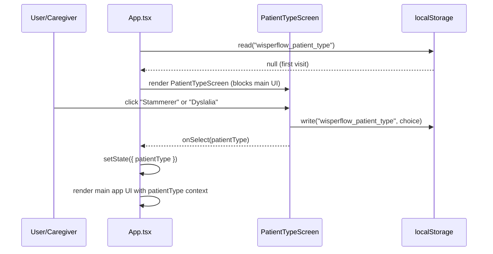

# Design Document: Patient Type Selection

## Overview

WisperFlow currently treats all users identically through a single correction pipeline
optimised for stammering (repetition/disfluency patterns). This feature adds a
**patient-type selection screen at app launch** so the user (or caregiver) can choose
between **Stammerer** and **Dyslalia** modes before the main UI is shown.

The selection is persisted in `localStorage`, can be changed at any time via a floating
settings button, and drives three orthogonal concerns:

1. **Word-limit policy** — how many words the corrected output is allowed to add or remove relative to input.
2. **Pipeline pre/post-processing** — whether repetition/disfluency cleanup is applied.
3. **LLM prompt strategy** — whether the model should focus on repetition removal (Stammerer) or phoneme-substitution correction (Dyslalia).

Additionally this feature encompasses:
- Removing all Groq API usage from the *correction* path (Groq stays only for Whisper STT).
- Cleaning up leftover dev/benchmark artefacts from the project root.
- Extending the ML sidecar with a dyslalia phoneme-substitution dataset and fine-tuning hook.
- Accuracy improvement utilities (>80 % target on combined test dataset).

---

## Architecture

```mermaid
graph TD
    A[Browser — React/TypeScript] -->|"POST /api/correct\n{text, patientType, ...}"| B[Express Server]
    A -->|"POST /api/transcribe\n(audio blob)"| C[Groq Whisper v3]
    C -->|transcribed text| A
    B --> D[pipeline.js\nrunCorrectionPipeline\npatientType-aware]
    D --> E[macroPreProcess\ncondition on patientType]
    D --> F[ML Sidecar\nFastAPI — Python]
    D --> G[Ollama\nlocal LLM — phi4-mini]
    F -->|spell / grammar / hinglish| D
    G -->|corrected text| D
    D -->|final text| B
    B -->|{text}| A
    A --> H[Web Speech API\nTTS — hi-IN]

    subgraph "Patient Type State"
        I[localStorage\npatientType: stammerer | dyslalia]
        J[PatientTypeScreen\nlaunched on first visit]
        K[SettingsFAB\nchange at any time]
    end

    A --- I
    J --> I
    K --> I
```


---

## Sequence Diagrams

### App Launch — First Visit



### Audio Recording → Correction Flow (with patientType)

```mermaid
sequenceDiagram
    participant U as User
    participant A as App.tsx
    participant S as server/index.js
    participant PL as pipeline.js
    participant ML as ML Sidecar
    participant OL as Ollama

    U->>A: press mic → stop recording
    A->>S: POST /api/transcribe (audio blob)
    S->>Groq: Whisper v3 request
    Groq-->>S: {text: "मु-मुझे पानी चाहिए..."}
    S-->>A: {text}
    A->>S: POST /api/correct {text, patientType, corrections, pronunciation, scenarioContext}
    S->>PL: runCorrectionPipeline(text, ..., patientType)
    PL->>PL: macroPreProcess (stammerer: clean repetitions; dyslalia: skip)
    PL->>ML: /spell-correct
    ML-->>PL: spell-corrected text
    PL->>ML: /grammar-hindi
    ML-->>PL: grammar-corrected text
    PL->>OL: llmChat(patientType-aware prompt, text)
    OL-->>PL: corrected text
    PL->>PL: enforceWordLimit(patientType)
    PL->>PL: macroPostProcess
    PL-->>S: finalText
    S-->>A: {text: finalText}
    A->>TTS: speak(finalText)
```


---

## Components and Interfaces

### Component 1: PatientTypeScreen

**Purpose**: Full-screen modal shown on first launch (or when `patientType` is `null` in localStorage). Blocks the main app until the user makes a choice.

**Interface**:
```typescript
interface PatientTypeScreenProps {
  onSelect: (type: PatientType) => void;
}

type PatientType = 'stammerer' | 'dyslalia';
```

**Responsibilities**:
- Read `wisperflow_patient_type` from `localStorage` on mount.
- Render two large selectable cards with condition name, icon, and description.
- Persist selection to `localStorage` and call `onSelect`.
- Be fully accessible (keyboard-navigable, ARIA labels).
- Support both Hindi and English UI text.

---

### Component 2: SettingsFAB (Floating Action Button)

**Purpose**: Always-visible button in the main UI to change patient type without a full reload.

**Interface**:
```typescript
interface SettingsFABProps {
  currentType: PatientType;
  onTypeChange: (type: PatientType) => void;
}
```

**Responsibilities**:
- Show current mode icon (🗣️ Stammerer / 🔤 Dyslalia).
- On click, show a small inline picker (modal or popover).
- Update `localStorage` and call `onTypeChange` which propagates to all pipeline calls.

---

### Component 3: PatientTypeContext (React Context)

**Purpose**: Makes `patientType` available to all components without prop-drilling.

**Interface**:
```typescript
interface PatientTypeContextValue {
  patientType: PatientType;
  setPatientType: (type: PatientType) => void;
}

const PatientTypeContext = React.createContext<PatientTypeContextValue>({...});
```

---

### Backend: Updated `/api/correct` endpoint

**New request body field**:
```typescript
interface CorrectRequestBody {
  text: string;
  patientType?: 'stammerer' | 'dyslalia';  // NEW
  corrections?: Correction[];
  pronunciation?: PronunciationEntry[];
  scenarioContext?: string;
}
```

**Responsibilities**:
- Accept and forward `patientType` to `runCorrectionPipeline`.
- Default to `'stammerer'` if omitted (backwards compatible).


---

## Data Models

### PatientType (shared frontend + backend)

```typescript
// src/types/patientType.ts  (new file)
export type PatientType = 'stammerer' | 'dyslalia';

export const PATIENT_TYPE_STORAGE_KEY = 'wisperflow_patient_type';

export interface PatientTypeConfig {
  wordLimitMin: number;   // fraction of inputWords (e.g. 0.70)
  wordLimitMax: number;   // fraction of inputWords (e.g. 1.00)
  cleanRepetitions: boolean;
  promptMode: 'stammer-cleanup' | 'phoneme-substitution';
}

export const PATIENT_TYPE_CONFIGS: Record<PatientType, PatientTypeConfig> = {
  stammerer: {
    wordLimitMin: 0.70,
    wordLimitMax: 1.00,
    cleanRepetitions: true,
    promptMode: 'stammer-cleanup',
  },
  dyslalia: {
    wordLimitMin: 0.95,
    wordLimitMax: 1.05,
    cleanRepetitions: false,
    promptMode: 'phoneme-substitution',
  },
};
```

### Dyslalia Phoneme Substitution Dataset (ML Sidecar)

```python
# ml_sidecar/dyslalia_patterns.py  (new file)
DYSLALIA_SUBSTITUTIONS = {
    # English phoneme substitutions (common in dyslalia)
    "r→w":   [("r", "w")],   # rhotacism: "rabbit" → "wabbit"
    "s→th":  [("s", "th")],  # "sun" → "thun"
    "l→y":   [("l", "y")],   # "lion" → "yion"
    "f→p":   [("f", "p")],   # "fish" → "pish"
    "v→b":   [("v", "b")],   # "van" → "ban"

    # Hindi phoneme substitutions
    "र→ल":   [("र", "ल")],   # ra → la
    "श→स":   [("श", "स")],   # sha → sa
    "क→त":   [("क", "त")],   # ka → ta
    "ड→ल":   [("ड", "ल")],   # da → la
    "व→ब":   [("व", "ब")],   # va → ba
    "ग→ड":   [("ग", "ड")],   # ga → da
    "च→त":   [("च", "त")],   # cha → ta
    "झ→ज":   [("झ", "ज")],   # jha → ja
    "फ→प":   [("फ", "प")],   # pha → pa
    "ध→द":   [("ध", "द")],   # dha → da
}

# Training pairs: (dyslalia_input, correct_output)
# Used to fine-tune/augment the spell corrector for dyslalia patterns
DYSLALIA_DATASET: list[dict] = [
    {"input": "मुझे लोटी चाहिए",   "expected": "मुझे रोटी चाहिए",  "pattern": "र→ल"},
    {"input": "सो लहा हूँ",         "expected": "सो रहा हूँ",       "pattern": "र→ल"},
    {"input": "मेला नाम लाम है",   "expected": "मेरा नाम राम है",  "pattern": "र→ल"},
    {"input": "सकूल जाना है",       "expected": "स्कूल जाना है",    "pattern": "श→स"},
    {"input": "तपड़े पहनना है",     "expected": "कपड़े पहनना है",   "pattern": "क→त"},
    {"input": "पानी दे दो",         "expected": "पानी दे दो",       "pattern": "none (control)"},
    {"input": "दर्द तर रहा है",     "expected": "दर्द कर रहा है",   "pattern": "क→त"},
    {"input": "बाहल आई है",         "expected": "बारिश आई है",      "pattern": "र→ल"},
]
```


---

## Algorithmic Pseudocode

### Main: enforceWordLimit (patientType-aware)

```pascal
FUNCTION enforceWordLimit(input, output, patientType)
  INPUT:  input      — original raw text (string)
          output     — LLM-corrected text (string)
          patientType — 'stammerer' | 'dyslalia'
  OUTPUT: trimmed output (string)

  PRECONDITIONS:
    - input is a non-empty string
    - output is a non-empty string
    - patientType ∈ {'stammerer', 'dyslalia'}

  POSTCONDITIONS:
    - returned string has word count in [minWords, maxWords]
    - if output is already within limits, returned unchanged
    - no content is added beyond what output contains

  inputWords ← countWords(input)
  IF inputWords = 0 THEN RETURN output END IF

  IF patientType = 'dyslalia' THEN
    minWords ← FLOOR(inputWords × 0.95)
    maxWords ← CEIL(inputWords × 1.05)
  ELSE  // stammerer (default)
    minWords ← FLOOR(inputWords × 0.70)
    maxWords ← inputWords  // max 100%
  END IF

  outputWords ← countWords(output)

  IF outputWords ≤ maxWords THEN
    RETURN output
  END IF

  // Trim to maxWords
  words ← output.split(' ')
  trimmed ← words[0..maxWords-1].join(' ')
  LOG "[word-limit] patientType=" + patientType + " trimmed " + outputWords + "→" + maxWords
  RETURN trimmed
END FUNCTION
```

**Loop Invariants**: N/A — no loops.

---

### Main: macroPreProcess (patientType-aware)

```pascal
FUNCTION macroPreProcess(rawText, userCorrections, pronProfile, patientType)
  INPUT:  rawText        — Whisper-transcribed text
          userCorrections — user DB corrections array
          pronProfile     — pronunciation profile array
          patientType     — 'stammerer' | 'dyslalia'
  OUTPUT: preprocessed text (string)

  PRECONDITIONS:
    - rawText is a string (may be empty)
    - patientType ∈ {'stammerer', 'dyslalia'}

  POSTCONDITIONS:
    - if patientType = 'stammerer': repetition patterns removed
    - if patientType = 'dyslalia': NO repetition removal applied
    - Hinglish transliteration always applied
    - DB corrections always applied
    - phonetic rules always applied

  // Step 1: Always — Hinglish transliteration
  text ← transliterateHinglish(rawText)

  // Step 2: Conditional — stammerer disfluency cleanup ONLY
  IF patientType = 'stammerer' THEN
    // Remove hyphenated syllable repetitions: "मु-मुझे" → "मुझे"
    text ← text.replace(/([\u0900-\u097F]{1,3})-\1/g, '$1')
    // Remove prolonged vowel marks: "पाआनी" → "पानी"
    text ← text.replace(/([\u093E-\u094C])\1+/g, '$1')
  END IF
  // For dyslalia: skip repetition removal entirely

  // Step 3: Always — DB word/phrase corrections
  text ← applyCorrections(text, userCorrections)

  // Step 4: Always — pronunciation profile
  text ← applyPronunciationProfile(text, pronProfile)

  // Step 5: Always — phonetic rules
  text ← applyPhoneticRules(text)

  RETURN text
END FUNCTION
```

---

### Main: buildLLMPrompt (patientType-aware)

```pascal
FUNCTION buildLLMSystemPrompt(patientType, inputWordCount, maxOutputWords, hints)
  INPUT:  patientType    — 'stammerer' | 'dyslalia'
          inputWordCount — integer
          maxOutputWords — integer
          hints          — {wordLookup, pronHints, hinglishHints, scenarioLine}
  OUTPUT: system prompt string

  PRECONDITIONS:
    - inputWordCount > 0
    - maxOutputWords ≥ inputWordCount × 0.70

  POSTCONDITIONS:
    - returned string contains patientType-specific correction instructions
    - stammerer prompt includes repetition cleanup guidance
    - dyslalia prompt includes phoneme-substitution guidance
    - dyslalia prompt explicitly forbids word addition/removal

  base ← "AAC सहायक। वाक् विकलांग व्यक्ति की अस्पष्ट बोली को सुधारो।"
  base ← base + hints.scenarioLine + hints.userCorrLine + hints.pronLine

  IF patientType = 'stammerer' THEN
    modeInstr ← """
    रोगी प्रकार: हकलाना (Stammerer)
    — दोहराव हटाओ: "मु-मुझे" → "मुझे", "पा-पानी" → "पानी"
    — Whisper गलतियाँ ठीक करो
    — व्याकरण सुधारो
    — शब्द सीमा: {inputWordCount} इनपुट → अधिकतम {maxOutputWords} शब्द
    """
  ELSE  // dyslalia
    modeInstr ← """
    रोगी प्रकार: वाक् ध्वनि विकार (Dyslalia)
    — ध्वनि-प्रतिस्थापन ठीक करो: "ल"→"र", "स"→"श", "त"→"क" आदि
    — शब्द न जोड़ो, न हटाओ — केवल गलत ध्वनियाँ बदलो
    — कोई दोहराव-सफाई नहीं
    — शब्द सीमा: {inputWordCount} इनपुट → {minWords}–{maxOutputWords} शब्द (strict 1:1)
    """
  END IF

  RETURN base + modeInstr + commonRules
END FUNCTION
```


---

## Key Functions with Formal Specifications

### `runCorrectionPipeline(rawText, corrections, pronunciation, expectedContext, scenarioContext, patientType)`

**Location**: `server/pipeline.js`

**Signature** (updated):
```javascript
export async function runCorrectionPipeline(
  rawText,
  corrections,
  pronunciation,
  expectedContext = null,
  scenarioContext = null,
  patientType = 'stammerer'   // NEW parameter
)
```

**Preconditions**:
- `rawText` is a non-null string.
- `patientType` ∈ `{'stammerer', 'dyslalia'}`.
- `corrections` is an array (may be empty).

**Postconditions**:
- Returns a Devanagari Hindi string.
- Word count is within `[min, max]` bounds dictated by `patientType`.
- If `patientType = 'dyslalia'`, no syllable-repetition regex was applied.
- If `patientType = 'stammerer'`, repetition patterns have been cleaned.

---

### `enforceWordLimit(input, output, patientType)` — updated signature

**Location**: `server/pipeline.js`

**Preconditions**:
- `patientType` ∈ `{'stammerer', 'dyslalia'}`.
- `input` and `output` are strings.

**Postconditions**:
- Stammerer: output word count ≤ `inputWords`.
- Dyslalia: output word count ∈ `[floor(inputWords×0.95), ceil(inputWords×1.05)]`.

---

### `GET /api/health` — updated response

**New field**:
```typescript
{ ok: boolean; groqConfigured: boolean; sidecarAvailable: boolean; patientTypeSupported: true }
```

---

### ML Sidecar: `POST /dyslalia-correct`

**Location**: `ml_sidecar/main.py` (new endpoint)

**Pydantic models**:
```python
class DyslaليaCorrectIn(BaseModel):
    text: str
    lang: Optional[str] = "hi"   # 'hi' | 'en'

class DyslalyaCorrectOut(BaseModel):
    corrected: str
    patterns_applied: List[str]   # e.g. ["र→ल", "क→त"]
    changed: bool
```

**Preconditions**:
- `text` length ≤ 2000 characters (truncated otherwise).
- `lang` is `'hi'` (Hindi) or `'en'` (English).

**Postconditions**:
- Returns `corrected` with phoneme substitutions reversed.
- `patterns_applied` lists which substitution patterns were triggered.
- HTTP 200 always returned — on error, echoes input unchanged.
- Word count of `corrected` equals word count of `text` (strict 1:1 mapping).

**Algorithm**:
```pascal
FUNCTION dyslalyaCorrect(text, lang)
  patterns ← DYSLALIA_SUBSTITUTIONS[lang]
  corrected ← text
  applied ← []

  FOR each (wrong_phoneme, correct_phoneme) IN patterns DO
    IF corrected contains wrong_phoneme THEN
      corrected ← corrected.replace(wrong_phoneme, correct_phoneme)
      applied.append(wrong_phoneme + "→" + correct_phoneme)
    END IF
  END FOR

  LOOP INVARIANT: len(words(corrected)) = len(words(text))

  RETURN {corrected, patterns_applied: applied, changed: applied.length > 0}
END FUNCTION
```


---

## Example Usage

### Frontend — reading and using patientType

```typescript
// src/App.tsx (updated)
import { PatientTypeScreen } from './components/PatientTypeScreen';
import { PATIENT_TYPE_STORAGE_KEY, type PatientType } from './types/patientType';

function readStoredPatientType(): PatientType | null {
  const stored = localStorage.getItem(PATIENT_TYPE_STORAGE_KEY);
  if (stored === 'stammerer' || stored === 'dyslalia') return stored;
  return null;
}

export default function App() {
  const [patientType, setPatientType] = useState<PatientType | null>(
    readStoredPatientType()
  );

  const handlePatientTypeSelect = (type: PatientType) => {
    localStorage.setItem(PATIENT_TYPE_STORAGE_KEY, type);
    setPatientType(type);
  };

  // Block main UI until patient type is chosen
  if (!patientType) {
    return <PatientTypeScreen onSelect={handlePatientTypeSelect} />;
  }

  // Pass patientType down to correction calls via context
  return (
    <PatientTypeContext.Provider value={{ patientType, setPatientType: handlePatientTypeSelect }}>
      {/* existing app JSX */}
    </PatientTypeContext.Provider>
  );
}
```

### Backend — patientType forwarded to pipeline

```javascript
// server/index.js — updated /api/correct handler
app.post('/api/correct', rateLimit(30), async (req, res) => {
  const { text, patientType = 'stammerer', corrections, pronunciation, scenarioContext } = req.body ?? {};

  // ... cache / dedup logic unchanged ...

  const pipelinePromise = runCorrectionPipeline(
    text,
    corrections,
    pronunciation,
    null,
    scenarioContext,
    patientType    // NEW
  );

  // ... rest unchanged ...
});
```

### Dyslalia mode — word limit enforcement example

```javascript
// patientType = 'dyslalia', input = "लोटी तपड़े दे दो" (4 words)
// min = floor(4 * 0.95) = 3, max = ceil(4 * 1.05) = 5

enforceWordLimit("लोटी तपड़े दे दो", "रोटी कपड़े दे दो", "dyslalia");
// → "रोटी कपड़े दे दो"  ✓  (4 words, within [3, 5])

enforceWordLimit("लोटी तपड़े दे दो", "रोटी कपड़े दे दो और पानी भी", "dyslalia");
// → "रोटी कपड़े दे दो"  ✓  (trimmed to maxWords=5, then 4)
```

### Groq removal — only local Ollama for correction

```javascript
// server/pipeline.js — llmChat after Groq removal
export async function llmChat(systemPrompt, userMessage, maxTokens = 256) {
  // Groq is ONLY used for /api/transcribe (Whisper). Never for correction.
  const model = process.env.OLLAMA_MODEL || 'phi4-mini';
  const url   = process.env.OLLAMA_URL   || 'http://localhost:11434';
  console.log(`[llm] using Ollama (${model})`);
  return await ollamaChat(systemPrompt, userMessage, maxTokens);
  // No Groq fallback for correction. If Ollama is unavailable, throw.
}
```


---

## Correctness Properties

*A property is a characteristic or behavior that should hold true across all valid executions of a system — essentially, a formal statement about what the system should do. Properties serve as the bridge between human-readable specifications and machine-verifiable correctness guarantees.*

### Property 1: Stammerer Word-Limit Bounds

*For any* non-empty input string and any LLM-generated output string, when `enforceWordLimit` is called with `patientType = 'stammerer'`, the returned text must have a word count between `floor(countWords(input) × 0.70)` and `countWords(input)` (inclusive).

**Validates: Requirements 4.1, 4.2, 4.3, 4.4**

### Property 2: Dyslalia Word-Limit Bounds

*For any* non-empty input string and any LLM-generated output string, when `enforceWordLimit` is called with `patientType = 'dyslalia'`, the returned text must have a word count between `floor(countWords(input) × 0.95)` and `ceil(countWords(input) × 1.05)` (inclusive).

**Validates: Requirements 5.1, 5.2, 5.3, 5.4**

### Property 3: Stammerer Pre-Processing Removes Disfluency Patterns

*For any* text containing a Devanagari hyphenated syllable-repetition pattern or repeated vowel marks, calling `macroPreProcess(text, ..., 'stammerer')` must return text that no longer contains those patterns.

**Validates: Requirements 6.1, 6.2**

### Property 4: Dyslalia Pre-Processing Does Not Remove Repetition Patterns

*For any* text that contains no phoneme substitution errors, calling `macroPreProcess(text, ..., 'dyslalia')` must return text that is identical with respect to word structure — no syllable-repetition removal is applied.

**Validates: Requirements 6.3**

### Property 5: Patient Type Persistence Round-Trip

*For any* valid `PatientType` value (`'stammerer'` or `'dyslalia'`), after `setPatientType(type)` is called (via App state, PatientTypeScreen, or SettingsFAB), `localStorage.getItem('wisperflow_patient_type')` must equal `type`.

**Validates: Requirements 2.3, 3.3, 1.3**

### Property 6: PatientTypeScreen Blocks Main UI When No Type Stored

*For any* state of the application where `localStorage` returns `null` or an invalid value for `wisperflow_patient_type`, the App must render only the PatientTypeScreen and no main application UI elements.

**Validates: Requirements 1.1**

### Property 7: PatientTypeScreen Not Shown When Valid Type Is Stored

*For any* valid `PatientType` value stored in `localStorage`, the App must render the main application UI directly and must not render the PatientTypeScreen.

**Validates: Requirements 1.5**

### Property 8: Invalid patientType Always Defaults to Stammerer

*For any* string value that is not `'stammerer'` or `'dyslalia'` (including absent/null values), the Backend must treat the `patientType` as `'stammerer'` and never pass the raw invalid value to `runCorrectionPipeline`.

**Validates: Requirements 9.1, 9.2**

### Property 9: Dyslalia Endpoint Preserves Word Count

*For any* input text string, `POST /dyslalia-correct` must return a `corrected` field whose word count equals the word count of the input `text` field (strict 1:1 word mapping).

**Validates: Requirements 10.3**

### Property 10: Dyslalia Endpoint Response Schema Is Always Valid

*For any* valid input to `POST /dyslalia-correct`, the response must always contain `corrected` (string), `patterns_applied` (list of strings), and `changed` (boolean) — even when no patterns match.

**Validates: Requirements 10.2**

### Property 11: Correction Path Never Contacts Groq

*For any* call to `runCorrectionPipeline` with any inputs and any `patientType`, no outbound HTTP request must target `api.groq.com` — all LLM correction traffic must go to the Ollama endpoint exclusively.

**Validates: Requirements 8.1**

### Property 12: LLM Prompt Always Contains Word-Count Bounds

*For any* valid positive integer input word count, `buildLLMSystemPrompt(patientType, inputWordCount, maxOutputWords, hints)` must return a string that includes the numeric word-count bounds computed from that input count — regardless of the patient type.

**Validates: Requirements 7.3**

---

## Error Handling

### Scenario 1: Ollama unavailable (Dyslalia mode, Groq removed)

**Condition**: Ollama process is not running when `/api/correct` is called.  
**Response**: `runLLMCorrection` throws; caught in pipeline step 2; step 2 returns step 1 output (grammar-corrected text without LLM pass).  
**Recovery**: User sees partially corrected text. No crash. Log message: `[step2-grammar] failed, using step1 output: ...`.  
**Note**: No Groq fallback for correction — this is intentional. User should be informed if Ollama is down.

### Scenario 2: Invalid patientType value arrives at backend

**Condition**: Client sends `patientType: 'unknown'`.  
**Response**: Backend defaults to `'stammerer'` via `patientType = 'stammerer'` destructuring default.  
**Recovery**: Pipeline runs normally with stammerer settings.

### Scenario 3: localStorage unavailable (private browsing)

**Condition**: `localStorage.setItem` throws (private/incognito or quota exceeded).  
**Response**: `handlePatientTypeSelect` catches the error, still calls `setPatientType` in React state.  
**Recovery**: Patient type works for the session; does not persist across reload. Show a non-blocking toast.

### Scenario 4: Dyslalia phoneme endpoint `/dyslalia-correct` fails

**Condition**: ML sidecar crashes or pattern match throws.  
**Response**: FastAPI returns `corrected = input, patterns_applied = [], changed = false` (HTTP 200).  
**Recovery**: Pipeline continues with unmodified text; logs warning.

### Scenario 5: User switches patient type mid-session

**Condition**: User changes from Dyslalia → Stammerer via SettingsFAB while correction is in-flight.  
**Response**: In-flight correction uses the `patientType` value captured at the time the request was sent (closure). New requests use the updated type.  
**Recovery**: Consistent per-request behaviour; no race condition.


---

## Testing Strategy

### Unit Testing Approach

Focus on pure functions that are easy to isolate:

- `enforceWordLimit(input, output, patientType)` — verify word count bounds for both types.
- `macroPreProcess(text, ..., patientType)` — verify repetition regex fires for stammerer, does NOT fire for dyslalia.
- `buildLLMSystemPrompt(patientType, ...)` — verify prompt contains mode-specific instructions.
- `dyslalyaCorrect(text, lang)` — verify Hindi and English phoneme substitutions are reversed.
- `readStoredPatientType()` — mock localStorage, verify correct parsing.

### Property-Based Testing Approach

**Property Test Library**: `fast-check` (already available in Node.js ecosystem)

Properties to test:

```typescript
// Test: Dyslalia word limit is always 95–105% (see Property 2)
fc.assert(fc.property(
  fc.string({ minLength: 1 }),
  fc.string({ minLength: 1 }),
  (input, output) => {
    const result = enforceWordLimit(input, output, 'dyslalia');
    const inW = countWords(input);
    const outW = countWords(result);
    return outW >= Math.floor(inW * 0.95) && outW <= Math.ceil(inW * 1.05);
  }
));

// Test: Stammerer output never exceeds input word count (see Property 1)
fc.assert(fc.property(
  fc.string({ minLength: 1 }),
  fc.string({ minLength: 1 }),
  (input, output) => {
    const result = enforceWordLimit(input, output, 'stammerer');
    return countWords(result) <= countWords(input);
  }
));

// Test: dyslalyaCorrect preserves word count (see Property 9)
fc.assert(fc.property(
  fc.array(fc.string({ minLength: 1 }), { minLength: 1, maxLength: 20 }),
  (words) => {
    const text = words.join(' ');
    const { corrected } = dyslalyaCorrect(text, 'hi');
    return countWords(corrected) === countWords(text);
  }
));
```

### Integration Testing Approach

- End-to-end: mount `<App>` with no localStorage → `PatientTypeScreen` renders → select a type → main app renders.
- API: POST `/api/correct` with `patientType: 'dyslalia'` and an input containing Hindi phoneme errors → verify output has same word count and phoneme corrections applied.
- Groq removal: mock `fetch` and assert no calls to `api.groq.com` originate from `/api/correct` handler.
- Accuracy: run existing `STAMMERER_DATASET` and new `DYSLALIA_DATASET` through pipeline, assert ≥80% score.

---

## Performance Considerations

- `PatientTypeScreen` is a lightweight React component with no async data fetching — zero performance impact on app startup.
- `patientType` parameter adds one conditional branch in `macroPreProcess` and `enforceWordLimit` — O(1) overhead.
- The new `/dyslalia-correct` sidecar endpoint applies string.replace operations only — O(n×p) where n=text length, p=number of patterns (~15). Negligible.
- Dyslalia `95–105%` word limit is actually *stricter* than the current `120%` limit, so it may reduce LLM token usage by encouraging shorter outputs.
- Groq removal from the correction path eliminates one network round-trip per request (Groq latency was ~500–2000ms). Correction latency now depends entirely on local Ollama throughput.

---

## Security Considerations

- `patientType` is user-controlled input from the frontend. The backend must validate it against the allowlist `['stammerer', 'dyslalia']` and default to `'stammerer'` for any unknown value. This prevents prompt-injection via crafted `patientType` values leaking into the LLM system prompt.
- `localStorage` data is same-origin only — no cross-origin leakage risk.
- Removing Groq from the correction path reduces the surface area for API key leakage (only Whisper STT still uses the key).
- The ML sidecar `/dyslalia-correct` endpoint should enforce `MAX_INPUT_LEN = 2000` characters (consistent with existing sidecar endpoints) to prevent resource exhaustion.

---

## Files to Create / Modify

### New Files
| File | Purpose |
|---|---|
| `src/types/patientType.ts` | Shared type definitions and config constants |
| `src/components/PatientTypeScreen.tsx` | Launch screen for mode selection |
| `src/components/PatientTypeScreen.css` | Styles for the selection screen |
| `src/components/SettingsFAB.tsx` | Floating button to change mode |
| `src/context/PatientTypeContext.tsx` | React context provider |
| `ml_sidecar/dyslalia_patterns.py` | Phoneme substitution dataset |

### Modified Files
| File | Change |
|---|---|
| `src/App.tsx` | Add patient type state, gate main UI on selection |
| `src/services/hindiCorrect.ts` | Forward `patientType` to `/api/correct` |
| `server/index.js` | Accept `patientType` in `/api/correct`; remove Groq from correction |
| `server/pipeline.js` | Thread `patientType` through pipeline; update `enforceWordLimit` + `macroPreProcess` + LLM prompts; remove Groq fallback from `llmChat` |
| `ml_sidecar/main.py` | Add `/dyslalia-correct` endpoint |

### Files to Delete (cleanup)
| File | Reason |
|---|---|
| `server/benchmark.js` | Dev-only benchmark utility |
| `server/benchmarkSample.js` | Dev-only |
| `server/compareAccuracy.js` | Dev-only |
| `server/generateDataset.js` | Dev-only dataset generation |
| `benchmark_results/` (directory) | Build artefact |
| `body.json` | Temp test file in project root |
| `response.txt`, `response2.txt` | Temp test output files |
| `result.json` | Temp test output |
| `corrections.json` | Stale root-level file (data is in localStorage) |

---

## Dependencies

| Dependency | Purpose | Where |
|---|---|---|
| `fast-check` | Property-based testing | Dev dependency (`npm i -D fast-check`) |
| Existing: `dotenv`, `express`, `multer`, `cors` | Server routing | No change |
| Existing: `react`, `react-dom` | Frontend | No change |
| Existing: `transformers`, `spello`, `fastapi` | ML sidecar | No change |
| Removed from correction: Groq `llama-3.3-70b-versatile` | No longer used for text correction | Remove from `llmChat` fallback |
| Stays: Groq Whisper v3 | Audio transcription only | No change |
